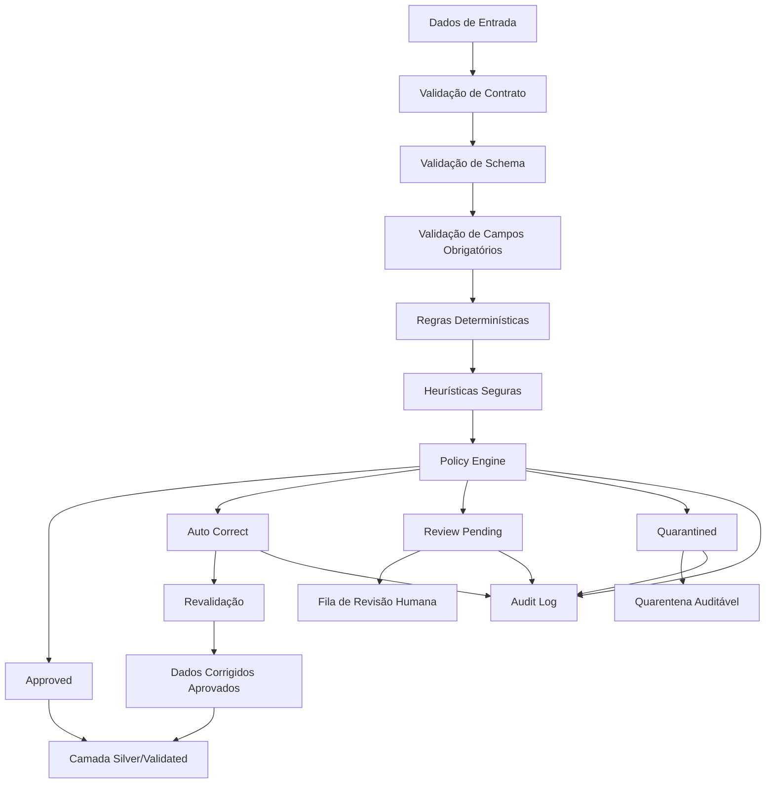

```mermaid
flowchart TD
    A[Dados de Entrada] --> B[Validação de Contrato]
    B --> C[Validação de Schema]
    C --> D[Validação de Campos Obrigatórios]
    D --> E[Regras Determinísticas]
    E --> F[Heurísticas Seguras]
    F --> G[Policy Engine]

    G --> H[Approved]
    G --> I[Auto Correct]
    G --> J[Review Pending]
    G --> K[Quarantined]

    I --> L[Revalidação]
    L --> M[Dados Corrigidos Aprovados]

    J --> N[Fila de Revisão Humana]
    K --> O[Quarentena Auditável]

    H --> P[Camada Silver/Validated]
    M --> P

    G --> Q[Audit Log]
    I --> Q
    J --> Q
    K --> Q
```

---

